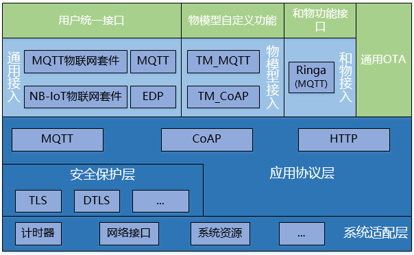
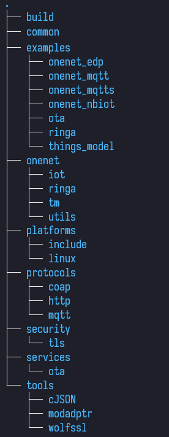
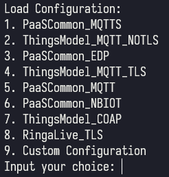
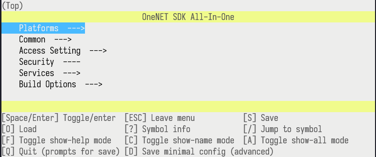

# OneNET AIO（All-In-One）

> ***注意**：*
>
> *OneNET_AIO使用的开源代码及其开源许可证如下：*
>
> *[DaveGamble/cJSON](https://github.com/DaveGamble/cJSON "Ultralightweight JSON parser in ANSI C")：**MIT***
>
> *[wolfSSL/wolfssl](https://github.com/wolfSSL/wolfssl "TLS/SSL library for embedded devices")：**GPLv2***
>
> *[eclipse/paho.mqtt.embedded-c](https://github.com/eclipse/paho.mqtt.embedded-c "Paho MQTT C client library for embedded systems")：**EPLv1、EDLv1***
>
> *[er-coap-13](https://github.com/eclipse/wakaama/tree/master/coap/er-coap-13 "Modified Erbium's CoAP engine by project eclipse/wakaama")：**BSD 3-Clause***
>
> *如果你有闭源需求，请移除**tools/wolfssl**目录，并重新移植TLS接口。*

- [概述](#概述)
- [sdk介绍](#sdk介绍)
  - [基本框架](#基本框架)
  - [代码目录说明](#代码目录说明)
- [sdk使用说明](#sdk使用说明)
  - [使用前准备](#使用前准备)
  - [sdk配置](#sdk配置)
  - [sdk代码导出](#sdk代码导出)
  - [sdk编译](#sdk编译)
- [sdk移植说明](#sdk移植说明)
  - [系统平台移植](#系统平台移植)
  - [平台接入应用](#平台接入应用)
  - [平台服务应用](#平台服务应用)
- [用户反馈](#用户反馈)

## 概述

[OneNET](https://open.iot.10086.cn/)物联网平台定位为PaaS服务，在物联网应用和真实设备之间搭建高效、稳定、安全的应用平台。对于设备，平台适配多种网络环境和常见传输协议，发展至今已包含**EDP**、**MQTT**、**Modbus**、**HTTP**、**MQTT物联网套件**、**NB-IoT物联网套件**等。

对于不同的设备接入协议，平台几乎都提供了一套对应的SDK代码或范例供用户开发参考。由于各种接入协议推出的跨度间隔时间较长，SDK缺乏统一规划，各种SDK的实现差异都比较大，目前也存在诸多问题：

- 用户每熟悉一个新的协议都将重头开始，成本较高
- 平台需要维护的SDK较多，SDK之间缺乏共性，需要投入的资源过多

为了解决这些问题，OneNET平台按照平台资源模型（产品 - 设备 - 数据流 - 数据点），统一抽象协议数据接口，统一底层系统接口，推出设备接入统一SDK：OneNET_AIO。

本SDK主要用于设备侧和平台的数据通信，要求设备侧可访问互联网，支持TCP/IP协议栈（根据不同的接入协议或服务，数据底层可能使用TCP通信或者UDP通信）。如果用户设备需要使用LoRa、Zigbee等不支持TCP/IP协议栈的本地通信方式，建议将用户设备接入本地的数据网关，在网关侧移植SDK/开发接入OneNET平台。

## SDK介绍

OneNET设备接入统一SDK以C语言源代码的方式提供，本身并不限制用户使用的硬件平台以及使用的操作系统，通过系统适配层的接口封装来屏蔽底层差异。

在实际使用中，用户需要自行完成系统适配层接口的实现。目前SDK已提供了基于Linux的实现源码，用户可参考实现。

### 基本框架

OneNET平台支持多种设备接入协议，提供如EDP、MQTT、Modbus、HTTP、MQTT物联网套件、NB-IoT物联网套件等，满足多种应用场景的使用需求。为了帮助开发者快速实现设备接入，减少对协议细节的学习成本，我们对最常用的几种协议进行了SDK封装，并进行上层用户接口的统一，帮助用户在一次开发后能近乎无缝切换使用其它接入协议。

SDK设计基于功能分层，基本应用框架如下图所示：

其中：

**系统适配层**：主要提供系统平台、芯片相关系统接口封装，包括计时器、网络收发接口、系统资源调用以及部分C库函数接口。SDK移植主要工作在于该功能层接口的实现。

**安全保护层**：主要用于向上层提供安全相关的应用接口，例如TLS接口、DTLS接口等。

**应用协议层**：该功能层目前集成了两个开源应用协议栈，MQTT - PahoMQTT、CoAP - ercoap，并根据各自的协议特点提供一套接口定义，便于后续替换协议栈或直接使用集成了通信协议栈的通信模组；此外，该功能层还提供了一套简单的HTTP应用接口，提供基本的组包和解包功能。

**通用接入/物模型接入/和物接入**：作为OneNET接入协议的核心层，主要用于封装OneNET平台各种接入协议数据。其中，通用接入模块适用于对数据有自主处理能力的用户，OneNET只作为数据通道；物模型接入构建了标准化的数据模型，用户需要对实体设备进行数字化，在云端定义该实体的数据模型；和物接入与物模型接入方式类似，区别在于数据通道及数据格式的定义不同（当前SDK只支持和物MQTT模式的接入）。

**用户统一接口**：主要针对通用接入方式，根据OneNET平台数据流模型抽象出统一接口。

**物模型自定义功能**：用户在使用物模型接入时，在云端定义实体设备的数据模型后，平台将根据用户配置自动生成对应的功能接口供用户集成使用。

**和物功能接口**：与物模型自定义功能类似。

**通用OTA**：OneNET向用户提供了一套基于HTTP协议的通用OTA接口，该接口不限接入协议，只要具备网络功能，均可使用。

### 代码目录说明

OneNET设备接入统一SDK基本目录结构如下图：

|  目录名   | 说明                                                         |
| :-------: | ------------------------------------------------------------ |
|   build   | 主要用于存放编译相关的内容，包括配置界面工具Kconfiglib、Windows平台下的命令行工具msys2、默认配置文件目录configs、编译规则文件rules |
|  common   | 主要包括一些常用的工具或算法接口封装，与系统平台无关         |
| examples  | 主要包括示例代码，分别对应到不同的接入协议                   |
|  onenet   | 主要包含平台接入协议相关代码，其中iot目录包含通用平台接入，tm目录包含物模型接入，ringa目录包含和物接入，utils目录包含一部分通用接口封装 |
| platforms | 主要包含系统适配层的内容，由include目录内的头文件定义适配接口，其它目录（例如图示linux）则包含对应平台的适配实现代码 |
| protocols | 主要包含应用协议层的内容，集成了两个开源协议栈和一个简单的HTTP功能接口库 |
| security  | 主要包含安全相关的接口封装，目前仅TLS接口实现。              |
| services  | 主要包含平台相关服务应用，例如通用OTA                        |
|   tools   | 主要包含一些开源工具或工具类接口封装                         |

## SDK使用说明

### 使用前准备

- 云端开发准备

  用户需要在OneNET平台注册帐号，了解OneNET接入相关的产品介绍，熟悉网页控制台的基本操作，并在控制台中根据需求创建对应接入协议的产品及设备实例。

- 本地开发准备

  用户需要在本地准备相应的开发、编译环境（推荐使用Ubuntu进行SDK的基础体验），并安装图形化配置工具所需的Python运行环境（要求Python3.2+）及curses库：
  
  - Linux（以Ubuntu为例）：
  
    `sudo apt install python3 libncurses6`
  
  - Windows：进入[Python官网](https://www.python.org/)下载适配您操作系统的安装包，并在python环境下进行安装：
  
    `pip install windows-curses`

### SDK配置

OneNET设备接入统一SDK使用了一个开源、基于Python的类内核Kconfig的图形化工具：[Kconfiglib](https://github.com/ulfalizer/Kconfiglib)，借助Python跨平台特性实现Linux、Windows双平台通用。SDK根据常见的应用场景，内置了若干个默认配置文件，用户可选择使用默认配置或自定义，也可以基于默认配置进行修改，满足个性化需求。

使用SDK配置功能需要在SDK顶层目录中运行指定脚本：

- Linux（以Ubuntu为例）：命令行运行`. config.sh`
- Windows：双击运行`config.cmd`

#### 配置基本操作

运行/点击命令启动配置界面后，用户首先可以看到加载选项，如下图所示：

用户可输入数字选择加载预置的配置文件进行配置或选择进行全自定义配置（直接回车为选择用户自定义配置）。

配置界面使用方向键的上下键来选择配置项，方向右键/回车键进入子菜单，方向左键/Esc键返回上级菜单。其它操作可参考配置界面下部的按键说明。

#### 配置项说明

- Platforms（平台相关）

  - Target Platform（编译目标平台类型）

    目前固定为**Linux**。

  - Target Platform Arch（编译目标平台架构类型）

    主要用于适配部分数据类型位宽，可选**32Bit**（32位架构）、**64Bit**（64位架构）。

- Common（通用配置）

  - Enable Debug Log（启用调试日志）

    - Debug Log Output Level（调试日志输出等级）

      设定调试日志输出等级，当日志等级低于设定等级时才能输出。可设定的输出等级由高到低依次为：**DEBUG**（调试）、**INFO**（信息）、**WARNING**（警告）、**ERROR**（错误）。

- Access Setting（平台接入设置）

  - Enable Access Setting（启用平台接入设置）

     平台接入相关的SDK代码可独立选择是否启用，以便用户独立使用OTA等功能。

     平台接入相关的配置项由**Access Method**（平台接入方法）和**Access Protocol**（平台接入协议）决定，具体配置项定义如下：

     - PaaS Common（通用接入）、EDP

       - EDP Notify With Ack（EDP协议上报是否需要响应）

     - PaaS Common（通用接入）、MQTT

     - PaaS Common（通用接入）、MQTTs

       - Enable TLS（启用TLS安全连接）

     - PaaS Common（通用接入）、NB-IoT

       - **Objects Max Count**（用户数据实例最大数量）和**Resource Max Count Per Object**（每个数据实例的最大资源数）

         选项仅当**Access Method**选择为**PaaS Common**，**Access Protocol**选择为**NB-IoT**时可见，用户可根据实际应用设置适当的值，节省内存开销。

       - Select Module（选择适配的NB模组）

           选项仅当**Access Method**选择为**PaaS Common**，**Access Protocol**选择为**NB-IoT**时可见。NB协议的接入通过适配NB模组来实现，目前仅适配中移物联网公司M5311模组。

     - Things Model（物模型接入）、MQTT

        - Enable TLS（启用TLS安全连接）
        - Gateway API for ThingsModel（启用网关功能接口）

     - Things Model（物模型接入）、CoAP

     - ThingsModel（物模型接入）、通用配置

        - File Management Service（启用文件管理接口）

           功能接口基于HTTP协议，要求设备侧必须具备TCP能力。

        - ThingsModel Protocol Ver.（物模型协议版本）

           固定为1.0。

        - Default Request Timeout（In ms）

             平台向设备下发的指令后，SDK内部回复指令时用于判定回复超时的超时时间设置，单位毫秒，可根据实际应用场景的网络条件进行修改。

        - Life Time（保活时间）

             用于配置设备心跳包超时间隔。当设备与平台的无数据交互时间超过该配置，平台将判定设备离线。
        
      - RingaLive（和物接入）

         - Ringa Region（配置和物接入服务器地址）

           目前和物在多个地区部署了服务器，用户可选择接入，可选：中国大陆、中国香港、海外。（各平台数据不互通，需要在对应平台创建产品）

        - Enable TLS（启用TLS安全连接）

        - Default Request Timeout（In ms）

           平台向设备下发的指令后，SDK内部回复指令时用于判定回复超时的超时时间设置，单位毫秒，可根据实际应用场景的网络条件进行修改。

        - Life Time（保活时间）

           用于配置设备心跳包超时间隔。当设备与平台的无数据交互时间超过该配置，平台将判定设备离线。

     - Buffer Setting（内部缓冲区大小设置）

        - Payload Length

           设置上报数据负载的长度。产品定义的功能点越多，字符串等类型的功能点数据越长则设置越大。

        - Send Buffer Length

           设置数据发送缓冲区长度，需大于Payload Length。

        - Receive Buffer Length

           设置数据接收缓冲区长度。如果下发数据较少、功能较简单，可适当减小。

  - Use Access Token（使用OneNET认证Token）

     可独立选择开启或关闭。如果选择了必须使用认证Token的接入协议，该配置将不可取消。

     - Access Token Signature Method（认证Token签名算法）

        可选MD5、SHA1、SHA256。

- Security（安全配置）

  - TLS Library（TLS功能库）

    当平台接入设置或通用OTA中的TLS功能被启用时选项可见，目前固定未WolfSSL。

- Services（服务）

  - General-OTA by http（启用通用OTA）
    - Enable TLS（启用TLS安全连接）

- Build Options（编译选项）

  主要用于配置Linux环境下（基于Makefile）编译可执行程序的参数。

  - Build Example（是否编译示例程序）

    编译系统将根据配置的接入协议编译对应的示例代码，并在当前目录生成名为onenet_aio的可执行程序。

  - Cross Compiler（设置交叉编译工具）

    默认为空。

  - Have <stdint.h>（是否支持stdint.h标准头文件）

  - C FLAGS（设置代码编译选项）

    以列表方式配置编译选项，例如`-g -Wall`等。

  - LD FLAGS（设置目标文件链接选项）

    以列表方式配置链接选项。

  - Link Libs（设置编译示例程序时需要链接的第三方库）

    以列表方式配置需要链接的第三方库，例如`-lpthread -lm`等。

### SDK代码导出

用户对SDK进行配置后，可选择将已配置功能相关的代码导出，无需使用全量SDK代码，方便用户使用其它IDE进行开发集成。

使用SDK代码导出功能需要在SDK顶层目录中运行：

- Linux（以Ubuntu为例）：命令行运行`. export.sh`
- Windows：双击运行`export.cmd`

### SDK编译

SDK默认使用Makefile方式进行编译，用户配置相关功能后，直接在SDK顶层目录运行`make`即可。

## SDK移植说明

### 系统平台移植

想要将SDK移植到其它硬件平台或适配其它操作系统，请参考[系统适配层接口移植说明](platforms/README.md)。

### 工具使用说明

工具层包含开源的加密库、AT模块等，请参考[工具层接口使用说明](tools/README.md)。

### 平台接入应用

- 通用PaaS协议接入

  请参考[通用PaaS接入](onenet/iot/README.md)。

- 和物接入

  请参考[和物接入](onenet/ringa/README.md)。

- 物模型接入

  请参考[物模型接入](onenet/tm/README.md)。

### 平台服务应用

- 远程升级OTA

  请参考[远程升级](services/ota/README.md)。

## 用户反馈

非常感谢你的反馈！[提交一个 Issue](https://github.com/cm-heclouds/OneNET_AIO_c/issues/new)。

