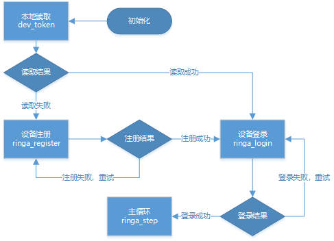
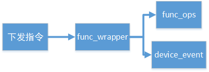

# 和物接入用户示例

[]()

- [文件说明](#文件说明)
- [主逻辑](#主逻辑)
- [功能点操作接口](#功能点操作接口)
  - [上报接口](#上报接口)
  - [读接口](#读接口)
  - [写接口](#写接口)
  - [文件修改](#文件修改)
- [功能点封装接口](#功能点封装接口)
- [ota](#ota流程)

## 文件说明

| 文件名            | 说明                                                         |
| ----------------- | ------------------------------------------------------------ |
| main.c            | 用户代码主逻辑                                               |
| func_ops.[ch]     | 平台根据用户定义的功能点信息，自动生成的操作接口文件         |
| func_wrapper.[ch] | 功能点封装接口，主要用于封装和物接入SDK（**onenet/ringa**）接口，对接**func_ops**接口 |

## 主逻辑

用户应用的主逻辑可以参考以下流程图：



## 功能点操作接口

功能点操作接口由平台自动生成。对于相关的接口的使用，后续以用户定义了一个名为“switch”的布尔型功能点为例进行说明。

### 上报接口

平台将根据定义的功能点名称，自动生成一个名为`func_xxx_upload`的功能点上报接口，其中**xxx**为功能点名称。以上例，生成的功能点上报接口如下：

```c
int32_t func_switch_upload(uint32_t timeout_ms);  
```

接口无需指定需要上报的功能点数据，由功能点读接口自动获取。

### 读接口

平台将根据定义的功能点名称，自动生成一个名为`func_xxx_get`的功能点读接口，其中**xxx**为功能点名称。以上例，生成的功能点读接口如下：

```c
int32_t func_switch_get(uint8_t *val, uint16_t buf_len)
{
    boolean value;          
    /** 请填入功能点值的获取逻辑，并将值赋给变量value */
    value = 1;
    
    /***/
    return set_by_binary(&value, val, buf_len, sizeof(boolean));
}
```

平台会根据定义的功能点数据类型生成一个变量定义：value（上述为布尔型），用户只需要按照自己的设备逻辑获取该功能点的值，将其赋值给value即可。

### 写接口

平台自动生成的写接口与读接口类似，命名为`func_xxx_set`。以上例，生成的功能点写接口如下：

```c
int32_t func_switch_set(uint8_t *val, uint16_t val_len)
{
    boolean value = (boolean)(*val);
    /** 根据变量value的值，填入下发控制逻辑 */
    log_info("bool value %d\n", value);

    /***/
    return 0;
}
```

接口内会根据功能点定义的类型自动转换为对应的数据类型，用户直接使用即可。

### 文件修改

由于目前平台生成的接口文件主要用于适配MCU，稍有区别，需要手动对功能点操作接口文件进行修改。

1. 提取下载的mcu sdk中的func_ops.c和func_ops.h，覆盖进OneNET_AIO/examples/ringa目录

2. 修改func_ops.c

   1. 移除头文件列表，修改为以下文件：**err_def.h**、**plat_osl.h**、**ringa_tlv.h**、**func_ops.h**、**func_wrapper.h**

   2. 替换函数`func_get_val()`中代码段

      ```c
      query_len += tlv_pack(buf + query_len, TLV_INT, (uint8_t *)&func_info, 4);
      ```

      为：

      ```c
      query_len += ringa_tlv_ser(buf + query_len, RINGA_TLV_INT, (uint8_t *)&func_info, 4);
      ```

   3. 替换`device_upload`为`func_upload`

## 功能点封装接口

用户在调用设备登录接口前需调用如下接口：

```c
void func_wrapper_init(device_event_cb evt_callback);  
```

该接口内部会调用`ringa_set_callback`接口用于处理平台下发命令，并根据命令类型分发到不同的处理逻辑，如下图所示：



> *注：用户使用`func_wrapper_init`设置设备事件回调后，无需再调用`ringa_set_callback`接口。*

### OTA流程

设备侧OTA流程由设备事件触发。当用户通过`func_wrapper_init`注册的回调函数收到**DEVICE_EVT_ID_FOTA_REQUEST**事件时，调用通用OTA接口（**services/ota/ota_api.h**）完成OTA流程。

通用OTA流程可参考[OTA官方文档](https://open.iot.10086.cn/doc/ota/book/develop/south-API/api-list.html)或示例代码（**examples/ringa/main.c：device_ota**）。