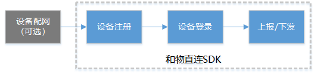

# 和物接入

[]()


- [概述](#概述)
- [基本流程](#基本流程)
- [用户接口说明](#用户接口说明)
  - [设备注册](#设备注册)
  - [设备接入](设备接入)
- [用户用例](#用户用例)

  - [典型应用](#典型应用)
  - [透传应用(暂未使用)](#透传应用-暂未使用)

## 概述

[和物](https://open.iot.10086.cn/hewu/website/)基于OneNET PaaS服务，专注于智能云和SaaS应用服务，向用户提供物联网软硬件一体化的解决方法，形成端到端的智能服务产品，让用户能将精力专注于硬件产品研发，以最低成本、最高效率、最快运营实现硬件智能化、产品商业化，获得产品最大价值空间。

一般情况下，建议用户直接使用和物提供的通信模组，其中内置了平台接入相关的功能，只需要通过串口向模组发送指令即可完成接入。如果你使用的通信模组不在和物平台支持范围内，或使用了网卡等直接通信方式，则需要使用SDK的接口来完成和物功能集成。

和物支持MQTT和LwM2M两种接入方式，目前SDK只支持MQTT协议，如需使用LwM2M方式，请使用和物模组。

## 基本流程

和物设备接入的基本流程如下图所示：



其中，设备配网主要用于Wi-Fi类设备。APP通过蓝牙、设备热点等方式将目标路由器信息以及设备注册鉴权信息发送到设备端，设备端连接目标路由器后向中移和物平台发起设备注册等后续流程。

## 用户接口说明

### 设备注册

- 头文件

  ```c
  onenet/ringa/ringa_reg.h
  ```

- 接口说明

  - 关键定义

    - 注册结果

      ```c
      struct ringa_reg_result_t
      {
          uint8_t *dev_token;
          uint8_t *dev_id;
      };
      ```

    - 注册事件

      ```c
      enum ringa_reg_event_e
      {
          RINGA_REG_EVT_CONNECTED,    /**< 连接上注册服务器，无事件数据*/
          RINGA_REG_EVT_DISCONNECTED, /**< 从注册服务器断开，无事件数据*/
          RINGA_REG_EVT_SUCCESSED,    /**< 注册成功，返回注册结果*/
          RINGA_REG_EVT_FAILED,       /**< 注册失败，无事件数据*/
          RINGA_REG_EVT_TIMEOUT       /**< 注册超时，无事件数据*/
      };
      typedef int32_t (*ringa_reg_evt_cb)(enum ringa_reg_event_e /* evt*/, void * /* evt_data*/, uint32_t /* evt_data_len*/);
      ```

      不同的注册事件具备不同的事件数据，定义如下表：

      |     evt      |      evt_data      |           evt_data_len            |
      | :----------: | :----------------: | :-------------------------------: |
      |  CONNECTED   |         无         |                 0                 |
      | DISCONNECTED |         无         |                 0                 |
      |  SUCCESSED   | 指向注册结果的指针 | sizeof(struct ringa_reg_result_t) |
      |    FAILED    |         无         |                 0                 |
      |   TIMEOUT    |         无         |                 0                 |

  - 接口说明

      设备注册结果采用同步工作方式，可根据实际需求设定超时时间。

      ```c
      /**
       * @brief 和物设备注册，执行结果以注册事件收到注册结果判定为成功。
       * 
       * @param product_id 产品ID，参考和物产品控制台页面显示内容
       * @param dev_name 设备名称，由用户自定义，产品范围内唯一，有效字符包括字母、数字、_（下划线）、-（中横线），长度4~32字符
       * @param connection_id 当设备为Wi-Fi类设备时，通过SoftAP或蓝牙等方式从APP端获取；其它联网方式的设备时，与dev_name一致
       * @param binding_token 当设备为Wi-Fi类设备时，通过SoftAP或蓝牙等方式从APP端获取；其它联网方式的设备时，与product_id一致
       * @param reg_callback 用于设置注册事件回调函数
       * @param timeout_ms 接口工作为同步方式，该参数用于设定超时时间，单位毫秒
       * @retval  0 执行成功
       * @retval <0 执行错误，错误类型参考err_def.h  
       */
      int32_t ringa_register(const uint8_t *product_id, const uint8_t *dev_name, const uint8_t *connection_id, const uint8_t *binding_token, ringa_reg_evt_cb reg_callback, uint32_t timeout_ms);
      ```


### 设备接入

- 头文件

  ```c
  onenet/ringa/ringa_api.h
  ```

- 接口说明

  - 关键定义

    - 设备下发命令回调

      ```c
      typedef int32_t (*ringa_cmd_cb)(const uint8_t * /* cmd_id*/, void * /* cmd_data*/, uint32_t /* cmd_data_len*/);
      ```

      其中，**cmd_id**：用于唯一标识该次下发命令，响应时需保持相同；

      **cmd_data**：平台下发命令的原始数据，可自行按和物协议解析，也可以调用示例代码的接口进行解析；

      **cmd_data_len**：平台下发命令的原始数据长度。

  - 接口说明

    - 设置下发命令回调

      主要用于用户向sdk设置下发命令回调接口，当接收并成功解析到平台下发数据后，通过该接口通知用户。

      ```c
      /**
       * @brief 设置下发命令回调函数，必须在调用登录接口前调用。
       * 
       * @param callback 设备下发命令回调函数指针
       */
      void ringa_set_callback(ringa_cmd_cb callback);
      ```

    - 设备登录

      设备登录接口设计为同步模式，用户可以根据实际需要调整其超时时间；此外，在调用该接口前需要确保已经通过**设备配网**或**读取设备标识**等方式获得了设备登录信息。

      ```c
      /**
       * @brief 设备登录
       * 
       * @param product_id 产品ID，需要与设备注册时使用的产品ID一致
       * @param dev_name 设备名称，需要与设备注册时使用的设备名称一致
       * @param dev_token 设备登录鉴权，由设备注册接口注册成功时返回
       * @param life_time 长连接保活时间（单位秒）。当平台与设备间超过一定时间（1.5倍life_time）没有任何数据交互时，平台将判定设备离线，断开长连接
       * @param timeout_ms 登录超时时间（单位毫秒）。登录接口为同步机制，需要根据实际应用场景设定合适的超时时间
       * @retval  0 成功
       * @retval <0 执行错误，错误类型参考err_def.h
       */
      int32_t ringa_login(const uint8_t *product_id, const uint8_t *dev_name, const uint8_t *dev_token, uint16_t life_time, uint32_t timeout_ms);
      ```

    - 设备登出

      ```c
      /**
       * @brief 设备登出
       * 
       * @param timeout_ms 登出超时时间（单位毫秒）。按正常流程，设备需要向平台发送断开请求后才能断开网络连接
       * @retval  0 成功
       * @retval <0 执行错误，错误类型参考err_def.h
       */
      int32_t ringa_logout(uint32_t timeout_ms);
      ```

    - 上报数据

      ```c
      /**
       * @brief 数据上报
       * 
       * @param raw_data 需要上报的原始数据（和物TLV格式），用户可自行按协议封装，也可以调用示例代码的接口进行封装
       * @param raw_data_len 需要上报的原始数据长度
       * @param ds_id 指定上报数据的标识，一般设置为空，需要进行数据透传到自己的应用时自行定义
       * @param timeout_ms 上报数据的超时时间（单位毫秒）。上报接口为同步机制，需要根据实际应用场景设定合适的超时时间
       * @retval  0 成功
       * @retval <0 执行错误，错误类型参考err_def.h
       */
      int32_t ringa_notify(uint8_t *raw_data, uint16_t raw_data_len, const uint8_t *ds_id, uint32_t timeout_ms);
      ```

    - 下发命令响应

      ```c
      /**
       * @brief 命令响应
       * 
       * @param cmd_id 下发命令ID，需要与下发命令回调中收到的对应命令ID相同
       * @param cmd_resp 需要响应的命令数据（和物TLV格式），用户可自行按协议封装，也可以调用示例代码的接口进行封装
       * @param cmd_resp_len 需要响应的命令数据长度
       * @param timeout_ms 响应数据的超时时间（单位毫秒）。响应接口为同步机制，需要根据实际应用场景设定合适的超时时间
       * @retval  0 成功
       * @retval <0 执行错误，错误类型参考err_def.h
       */
      int32_t ringa_cmd_resp(const uint8_t *cmd_id, uint8_t *cmd_resp, uint16_t cmd_resp_len, uint32_t timeout_ms);
      ```

    - 主循环

      ```c
      /**
       * @brief 设备主循环，主要用于接收并解析平台下发的数据，解析成功后通过设置的下发命令回调接口传递给用户；同时本接口还负责维护连接保活
       *
       * @param timeout_ms 每次尝试接收网络数据的持续时间（单位毫秒）
       * @retval  0 成功
       * @retval <0 执行错误，错误类型参考err_def.h
       */
      int32_t ringa_step(uint32_t timeout_ms);
      ```

    - 上报休眠

      某些具备低功耗休眠状态的设备，日常可能进入休眠状态而无法保持心跳包的维持。设备可调用**上报休眠**接口通知平台进入休眠状态，保持设备在线状态。

      ```c
      /**
       * @brief 上报设备进入休眠
       * 
       * @param timeout_ms 上报超时时间（单位毫秒）
       * @retval  0 成功
       * @retval <0 执行错误，错误类型参考err_def.h
       */
      int32_t ringa_notify_sleep(uint32_t timeout_ms);
      ```

    - 上报设备唤醒

      与**上报休眠**接口配合使用。

      ```c
      /**
       * @brief 上报设备唤醒
       * 
       * @param timeout_ms 上报超时时间（单位毫秒）
       * @retval  0 成功
       * @retval <0 执行错误，错误类型参考err_def.h
       */
      int32_t ringa_notify_wakeup(uint32_t timeout_ms);
      ```

## 用户用例

### 典型应用

按照和物标准开发流程，用户需要在平台侧创建产品，并定义该产品的功能点。平台将根据配置的功能点信息，自动生成相应的操作代码提供用户下载使用。具体的使用方法请参考[ringa_example](../../examples/ringa/README.md)。

### 透传应用-暂未使用

用户不使用和物平台自动生成的功能点封装代码或需要将数据透传到自己的服务平台时，可直接按SDK接口说明，自己使用前述接口来登录、连接平台。

